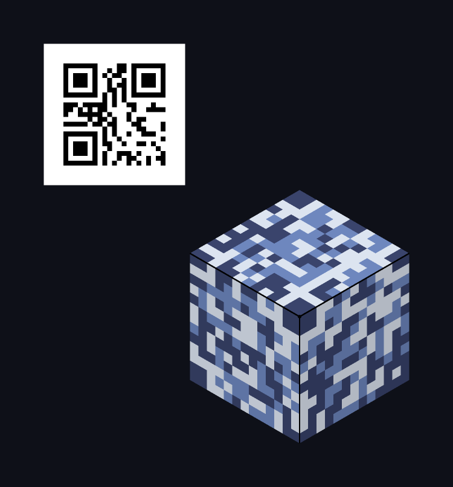
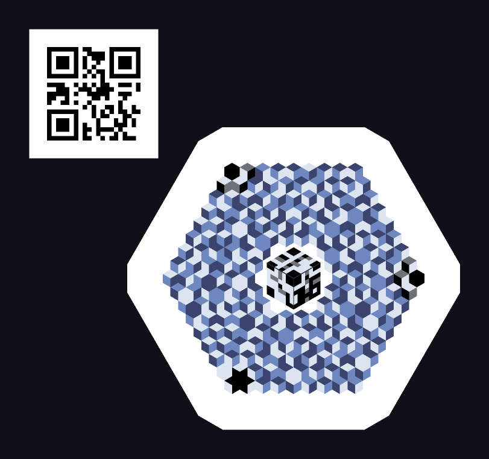
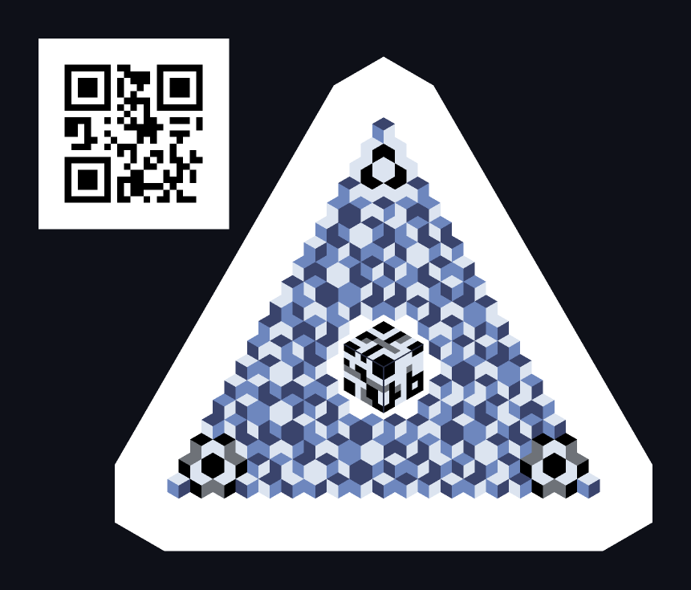

# TLcube — TrilLuminance (cube)

[English](README.md) · **한국어**

> 정식 명칭 **TrilLuminance (cube)** · 코드네임 Trilume.
> 육각형을 마름모 3면으로 분할하고, 3면 간 **휘도 순위(순열)** 로 데이터를 싣는 3D 바코드(실은 2.5D).
> 상태: **인코더·디코더·실카메라 스캐너 동작 중** — 브라우저 생성기와 스캐너가 라이브다.

<p align="center">
  
  
  
</p>

---

## 무엇인가

각 육각 셀을 rhombille 타일링으로 3개의 마름모(`T` 상단 · `L` 좌측 · `R` 우측)로 나누고, 세 면의 **상대 휘도 순서** 로 데이터를 싣는다. 3면의 순열은 3! = 6가지 → 셀당 base-6 digit 하나(log₂6 ≈ 2.585 bit).

결과물은 *제각각 다른 방향에서 빛을 받은 아이소메트릭 큐브 필드* 처럼 보인다. 인코딩 원리와 비주얼이 일치하는 코드다.

## 왜

**QR 대체재가 아니다.** 마름모 셀은 모듈 밀도에서 정사각 대비 불리하고, 그건 이미 결론이 난 이야기다. 노리는 것은 둘:

1. **미학** — 그 자체로 전시 가능한 코드
2. **차분 인코딩 강건성** — 데이터가 절대 휘도가 아니라 셀 내 3면의 **상대 순서** 에 실리므로, 단조(monotonic) 톤 커브 변형 — 전역 조명 변화, 감마, 프린터/디스플레이 톤 매핑 — 에 대해 이론상 불변

## 렌더러 자유도

데이터 계약은 **면 간 순서**와 **최소 분리폭(Δmin)** 뿐이다. 그 안에서 렌더러는 자유롭다 — 셀마다 절대 휘도를 지터해도, 색을 입혀도, 면 안에 그라데이션을 넣어도, 시간축으로 흔들어도 된다. 상대휘도 환산 후 순서만 보존되면 된다.

이 자유도가 이 포맷의 핵심 차별점이다.

## 타입 4종

| 타입 | 실루엣 | 순 페이로드 (ECC-M) |
|---|---|---|
| **O** | 육각 필드 | 18 / 39 / 65 B (k = 6 / 8 / 10) |
| **A** | 정삼각 실루엣 | 31 / 62 / 101 B (k = 6 / 8 / 10) |
| **K** | 육각별(A ∪ 반전 A) | 43 / 86 / 138 B (k = 6 / 8 / 10) |
| **Y** | 단일 아이소메트릭 큐브 | 31 / 98 / 141 B (n = 13 / 21 / 25) |

네 타입은 데이터 계약을 공유하고 실루엣만 다르다. 전부 **폴백 QR** 을 함께 인쇄할 수
있어서, TL 코드를 못 읽는 리더에게도 최소한의 경로가 남는다.

**K** 는 A 와 그 180° 상을 합집합한 육각별이다. 같은 k 에서 A 보다 셀이 많아 용량이
가장 크고, 여섯 꼭짓점이 검출 앵커를 겸한다.

## 상태

| 마일스톤 | 내용 | 상태 |
|---|---|---|
| M0 | 제너레이터 — 레이아웃 확정 | **완료** |
| M1 | 합성 디코더 | **완료** — `src/decoder/`, 테스트 파일 194개 |
| M2 | 실카메라 스캐너 | **동작 중** — [tlscan.estre.so](https://tlscan.estre.so) |
| M3 | 스타일 프리셋 · 패키징 | 진행 중 — 프리셋 4종 |

## 사용

```
node tools/dev-server.mjs        # http://localhost:8765 — 개발용 (index.html + src/)
node tools/build-single.mjs      # dist/trilume.html — 서버 없이 file:// 로 열리는 단일 파일
npm test                         # 전체 테스트 (node --test)
```

영상 촬영용 A4 인쇄 포스터는 [`print/tlcube-poster.html`](print/tlcube-poster.html) 이다. `file://` 로 연다. [`print/README.md`](print/README.md).

## 기술

바닐라 JavaScript. **빌드 툴체인 없음, 런타임 의존성 0.** 단일 HTML 파일로 동작한다.

내보내기는 **결정적**이다 — 동일 입력이면 PNG/SVG 가 바이트까지 동일하다. 그래서 픽셀은
브라우저 canvas 가 아니라 자체 래스터라이저(`src/raster.js`)가 만들고, PNG 인코딩도 자체
구현(`src/png.js`)이 한다. canvas 는 화면 미리보기 전용이다.

인코딩 경로: `encode.js` (페이로드 → RS(GF(211)) 코드워드 → 셀별 digit) → `scene.js`
(digit → 도형 목록) → canvas 미리보기 / `raster.js`+`png.js` / `svg.js`. 렌더 자체 검증은
`verify.js` — 샘플 원판 median 통계로 전 셀의 휘도 순위가 의도한 digit 과 일치하는지
픽셀에서 직접 확인한다.

## 스펙

포맷 규범은 **[SPEC.md](SPEC.md)** 다 — 기하·심볼 인코딩·레이아웃·용량·오류 정정·적합성 요건. 본문의 수치 표는 전부 `src/` 의 생성물이고, 와이어 계약은 `test/` 스냅샷이 정본이다.

**디코더만 구현해도 적합 구현**이다 (SPEC §11).

## 라이선스

이 repo 의 코드는 **[Apache License 2.0](LICENSE)** 으로 배포한다. Copyright 2026 SoliEstre.

**특허**: 2026-08-09 현재 SoliEstre 는 이 포맷에 관해 **보유하거나 출원 중인 특허가 없다.** 이 사실 진술은 조건 없이 누구나 이 포맷을 구현할 수 있다는 뜻이다 — 전체 구현이든 디코더만이든, 상업적이든 아니든 상관없다. (Apache-2.0 §3 이 배포된 코드에 대해 별도의 명시적 특허 실시권을 준다.)

**서드파티**: `src/vendor/jcodd.js` 는 [jcodd](https://github.com/Esterkxz/JCODD) 무수정 벤더링본이며 원본 MIT 라이선스가 적용된다 (파일 헤더에 원문 포함).

**상표 고지**: QR Code is a registered trademark of DENSO WAVE INCORPORATED.

---

*생성기: [tlcube.estre.so](https://tlcube.estre.so) · 소개: [tl.estre.so](https://tl.estre.so) · 스캐너: [tlscan.estre.so](https://tlscan.estre.so)*
