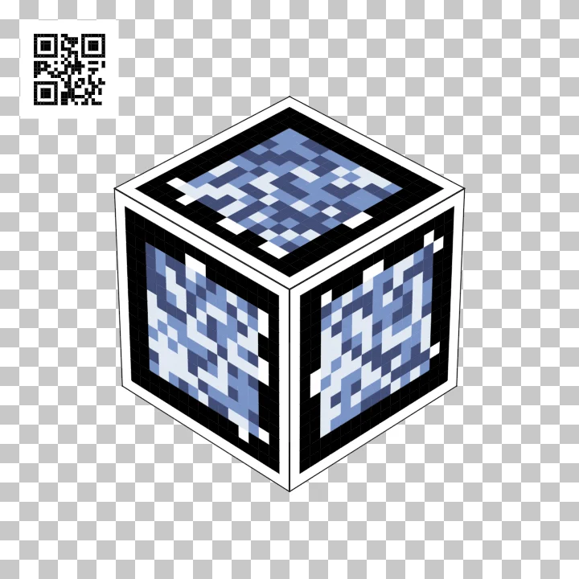
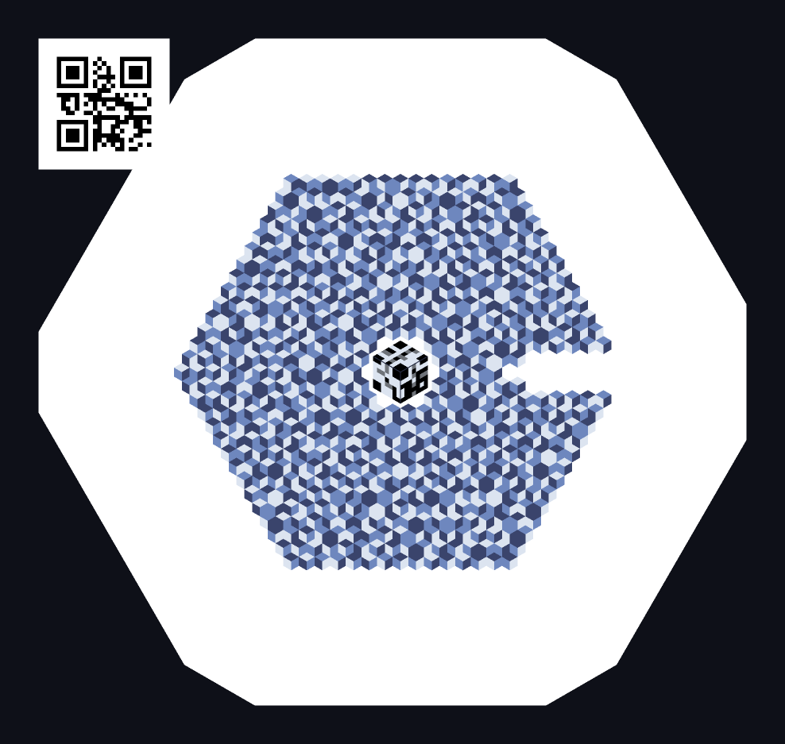
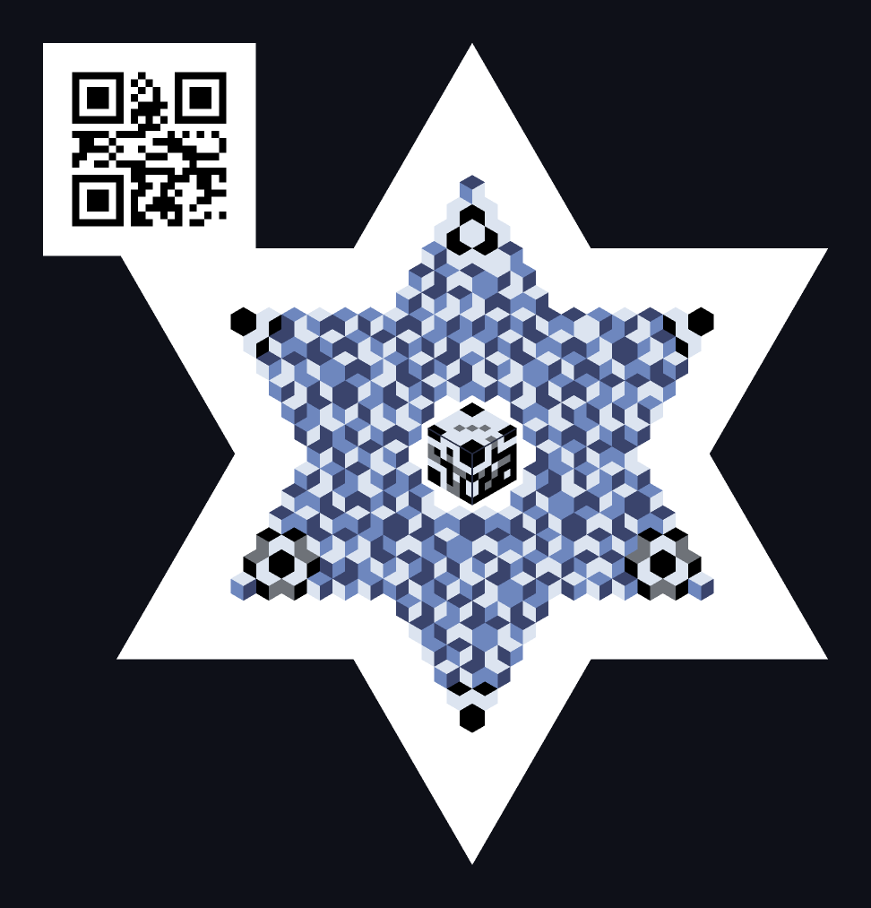

# TLcube — TrilLuminance (cube)

**English** · [한국어](README.ko.md)

> Formal name **TrilLuminance (cube)** · codename Trilume.
> A 3D barcode (actually 2.5D) that stores data in the **luminance rank** of three rhombic faces per hexagonal cell.
> Status: **encoder, decoder and live camera scanner all running** — the browser generator and scanner are live.

<p align="center">
  <a href="https://tl.estre.so/en/#types"></a><br>
  <sub>Type H, the Y group's true 3D cube, rotating on the transparency checkerboard · <a href="https://tl.estre.so/assets/type-H.mp4">watch the 720p MP4</a></sub>
</p>

<p align="center">
  <b><a href="https://tlcube.estre.so">Make one</a></b> · <b><a href="https://tlscan.estre.so">Scan one</a></b> · <b><a href="https://tl.estre.so/en/">Overview</a></b><br>
  <sub><a href="#types">Types</a> · <a href="#why-now">Why now</a> · <a href="#how-it-works">How it works</a> · <a href="#scanner">Scanner</a> · <a href="#spec">Spec</a></sub>
</p>

---

<!-- Do not put a type COUNT in this heading or the prose below (2026-09-03).
     It rotted: the heading still read "Four types" over a five-row table after Type C
     landed. The table is the source of truth for how many types there are, and
     test/readme-types.test.js fails if the prose asserts a count the table disagrees with.
     The image gallery is an HTML table on purpose: only markdown rows «| **X** |» count
     as types there, and Type H is an extension of the Y group, not a row of its own. -->
## Types

<table>
  <tr>
    <td align="center" width="33%"><br><b>Y</b> · single isometric cube</td>
    <td align="center" width="33%"><a href="https://tl.estre.so/assets/type-H.mp4"></a><br><b>H</b> · true 3D cube (Y group)</td>
    <td align="center" width="33%"><br><b>O</b> · hexagonal field</td>
  </tr>
  <tr>
    <td align="center" width="33%"><br><b>C</b> · notched hexagon, close range — zoom in to read</td>
    <td align="center" width="33%"><br><b>A</b> · triangular silhouette</td>
    <td align="center" width="33%"><br><b>K</b> · hexagram (A union inverted A)</td>
  </tr>
</table>

<p align="center"><sub>Every code shown encodes <code>https://tl.estre.so</code>.</sub></p>

| Type | Silhouette | Net payload (ECC-M) |
|---|---|---|
| **O** | Hexagonal field | 18 / 39 / 65 / 97 B (k = 6 / 8 / 10 / 12) |
| **A** | Triangular silhouette | 31 / 62 / 101 B (k = 6 / 8 / 10) |
| **K** | Hexagram (A union inverted A) | 43 / 86 / 138 B (k = 6 / 8 / 10) |
| **Y** | Single isometric cube | 31 / 98 / 141 B (n = 13 / 21 / 25) |
| **C** | Notched hexagon (Type O family, close-range) | 130 / 172 / 220 / 255 B (k = 14 / 16 / 18 / 20) |

The planar types share one data contract and differ only in silhouette; Type H below is the Y group's
true 3D extension with its own wire format. Every type can carry a **fallback QR** printed alongside,
so a reader that cannot decode the TL code still has a path.

**K** is a triangle unioned with its 180-degree image. At the same k it holds more cells than A,
so at each of k = 6, 8 and 10 it carries the largest payload, and its six points double as detection anchors.

### Type H — true 3D cube (Y group)

In the generator, the Y selector's **True 3D → H** switch turns the isometric drawing into a real cube.
H is a separate wire format ([H spec, SPEC §13](SPEC.md#13-h-v2--y-그룹의-실제-큐브-확장)) and does not use
Y's locators, shading or Y-style inset QR (window β / slot); H's own inset QR goes on blank faces (below).

- **Grid and faces.** 1–6 unique data faces, 2/3 tones, ECC L/M/H and H0…H8 grids (13…45 cells per side).
  In the three- and six-face formats the faces work in groups of three (`ZM, XM, YM`, then `ZP, XP, YP`):
  the three modules at the same coordinate carry one base-6 digit, so no single face completes the payload.
- **Capacity.** With the generator's automatic finder policy and three tones, ECC-M payloads are
  **3 / 21 / 45 / 78 / 119 / 123 / 185 / 255 / 333 B** for three faces and
  **6 / 42 / 90 / 156 / 238 / 330 / 440 / 510 / 666 B** for six faces (H0…H8).
- **Other face counts.** Two-, four- and five-face codes are separately identified pair/group packets
  ([SPEC §13.7](SPEC.md#137-h-v2f--h-v2fc--245개의-고유-데이터-면)), and one-face codes are single packets
  ([SPEC §13.9](SPEC.md#139-h-v2s--h-v2sc--한-물리면의-단일-패킷)); readers implement them from the spec, and adding
  them changed none of the existing formats' bytes. One-face H (`mode: 1`) combines two logical scan regions on XM
  into one RS/CRC-checked packet and has no H0; with strong ECC the default 19-byte URL selects H3 (25×25),
  with 19 B in two tones or 27 B in three.
- **Finders.** One- to five-face H5+ and six-face H7+ place four square corner finders, format and references
  inside the unchanged face grid; smaller sizes keep the frame finder, and legacy frame H stays readable.
  The library default `finder:'frame'` keeps the old capacities; the generator uses `finder:'auto'`.
- **Arrangement and blank faces.** Isometric (default), horizontal, vertical, or opposite faces (two faces only).
  Blank faces take an image (PNG/JPEG/WebP/SVG) or text, centered at the largest size that fits. Web fonts are
  fetched from Google Fonts or jsDelivr only when you pick one. Images and text stay in the current page.
- **Rotation.** Screen-axis X, Y (default) or Gyroscope — a synthetic two-axis rotation, not the device motion sensor.
  Tilt pattern Per turn (default), Per face or None; tilt 0–35° (default 17.5°), with gyro at a fixed 35°.
- **Video.** Auto-rotation exports as a silent square MP4 (720, 1080 or 1440 px; 24, 30, 60 (default) or 120 fps).
  A transparent background becomes a checkerboard, green (default), blue or magenta — not alpha video.
  Loops close after 720/speed seconds with Per turn, and after 360/speed seconds with Per face, None or Gyroscope.
- **Exports.** PNG/SVG as a sheet of all data faces or the current view only. The Y group's 3D data section adds
  glTF 2.0 models, Minecraft `.schem` structures with nearest-color concrete (not complete worlds) and PNG/SVG cube
  nets, all in the same physical coordinates as the maker files: seen from outside, every face reads the same way as the preview (not mirrored).
  Type Y's inset QR (window β / slot) is no exception: the preview, PNG/SVG and these files all draw it unmirrored.
- **Maker files.** Paper patterns and 3D-printing files for a physical cube (details below). A cube folded from the
  one-sheet net has been read by the scanner; the wrap skin, the board pieces and a 3D-printed cube have not yet
  been verified with a real scan.

<details>
<summary>More H options</summary>

- The preview panel provides screen-axis rotation, speed and independent pose/perspective controls.
  New H views default to 4° perspective and auto-rotation.
- Automatic X/Y and gyro speeds are 75/60°/s through H5, 60/45°/s for H6–H7, and 50/35°/s for H8.
  Manual speed overrides persist until the speed reset button restores the resolution-based defaults.
  Tilt has its own reset button.
- Per turn tilts toward the top cap for one turn and the bottom cap for the next; Per face wobbles three times per turn.
  Tilt patterns do not apply to gyro. Aligned horizontal/vertical layouts suppress the secondary tilt on their rotation axis.
- Isometric, horizontal and vertical arrangements separate the physical display from logical face IDs.
  Horizontal/vertical use at most four side faces and offer centered-seam alignment presets with screen Y/X rotation.
- One- to three-face codes repeat on the free opposite sides in six-face rendering ("6 faces (repeat)", except the
  opposite-faces arrangement); opposite faces that are both blank share one image. Blank-face images and
  opposite-face repetition use the same display mapping in 3D and in exports.
- Blank-face images take 45° rotation, contain/fill/cover and a background color; five-face H has one blank face.
  Images are included in visible-view exports, full nets, embedded glTF, rotation video and nearest-concrete schematic output.
- H has its own lighting controls; rotation fill lights data/reference tones together while protecting black/white finder marks.
- H supports a corner QR or an inset QR on blank faces. The inset QR puts the same TL scanner link as the corner QR
  on every blank face without an image or text, as a black-and-white face image (add or remove it per face in the
  blank-face editor); faces that become blank later are not filled automatically. It replaces the corner QR unless
  the advanced corner-QR option is on. It reads when a phone sees that face nearly head-on, so still images and 2.5D
  carry it only when that face is visible; 3D print files (3MF/STL) omit it like other face images.
  Like the code faces, it is not mirrored when seen from outside in any output: 2.5D PNG/SVG, the GPU preview, rotation video,
  glTF, the 3D-data net, .schem and the paper net.
  A .schem needs enough blocks per cell for the face QR, and the generator says when it does not have them.
  Corner QR preserves the cube's center and scene size.
- Video export needs WebCodecs AVC support at every frame rate, so the loop closes on an exact frame; it never falls back to a lower FPS.
- The mask defaults to 7 for new generator state; automatic size still prioritizes strong ECC. H previews use cached
  GPU face textures when available, with the exact scene renderer retained for exports and a Canvas fallback.

</details>

<details>
<summary>Maker files (paper and 3D printing)</summary>

With H active, the generator offers a collapsed *Maker files* section.
Every file is built in physical coordinates, so seen from outside the cube each face matches the screen (no mirror image).
For 3D printing it exports a 3MF with one part per color (Bambu Studio, OrcaSlicer, Cura), the same parts as a
per-color STL bundle (ZIP, for PrusaSlicer) and a single-color stand STL that holds the cube on a vertex.
Options cover cell size, embedded code depth (0.6–2.0 mm) and hollowing (on by default) with inner ribs and a vent hole
per chamber; the 3MF places the cube on the build plate, so slicers that keep file coordinates, such as Cura, open it on the plate.
Paper patterns come as a one-sheet net with glue tabs (paper up to 0.45 mm), a wrap skin with a board-core cutting list,
or butt-jointed board pieces, chosen by thickness. They export as millimeter-exact SVG, 300 dpi PNG and vector PDF, or print directly,
on A3, A4, A5, ISO and JIS B4/B5 and Letter, with plain paper, card, board and corrugated thickness presets or a measured thickness.
Each pattern carries a 50 mm calibration bar. If a printer driver shrinks the page, enter the measured bar length and the next
PNG, PDF and direct print are pre-scaled to compensate (remembered per paper size in this browser only). SVG stays unscaled
as the real-size file for cutting machines and editing.
A cube folded from the one-sheet net has been read by the scanner; the wrap skin, the board pieces and a 3D-printed cube have not yet been verified with a real scan.
The cube nets in the 3D data section are not mirrored either, but they have no glue tabs, cut and fold marks or scale calibration — for a paper cube, use these patterns.

</details>

## Why now

QR was the right answer for 1994. Two values, square modules and large finder patterns were all chosen so that a
camera of that era could read it at all, and under those constraints giving up on looks was rational. Phone cameras
and in-browser video processing now have headroom to spare. That headroom could go into more density, or into how
the code looks; TLcube spends it on looks.

**This is not a QR replacement.** Rhombic cells lose to square modules on density, and that argument is settled —
if you need to carry a lot, use QR. Two things are worth having instead:

1. **Aesthetics** — a code you would actually put on a wall.
2. **Differential-encoding robustness** — data lives in the **relative order** of three faces within a cell, not in absolute luminance. Any **monotonic** tone transform — global illumination change, gamma, printer/display tone mapping — leaves the order intact, and therefore the data.

## How it works

Each hexagonal cell is split by a rhombille tiling into three rhombi — `T` (top), `L` (left), `R` (right) — and data rides on the **relative luminance order** of those three faces. Three faces permute 3! = 6 ways, so one cell carries one base-6 digit (log₂6 ≈ 2.585 bits).

The result looks like *a field of isometric cubes, each lit from a different direction*. The encoding principle and the visual are the same thing.

## Renderer freedom

The data contract is only **the order between faces** and a **minimum separation (Δmin)**. Inside that, a renderer does what it likes: jitter absolute luminance per cell, apply color, gradient the inside of a face, animate over time. Only the order after conversion to relative luminance has to survive.

That freedom is the point of the format.

## Scanner

The scanner at [tlscan.estre.so](https://tlscan.estre.so) reads codes from the camera or from photos, with two
decoding engines, R1 and R2 (R2 by default).

- **Type H collection.** The scanner collects H faces across R2 camera frames or consecutive photos. It releases a
  payload only after all required unique 1–6 faces and full RS/CRC verification; partial faces expire 90 seconds
  after they were last seen. Camera and photo collections are separate. Y processing pauses while valid H partial
  collection is active and resumes after reset/expiry.
- **Links.** Verified H URLs follow the TL opening policy; ordinary fallback QR URLs remain manual.
  Changing the display language does not reopen the URL.
- **Ordinary QR.** In browsers that provide the `BarcodeDetector` API, R2 also reads ordinary QR codes from the camera.
  A link read from a QR code is never opened automatically: check the address, then tap to open it.
- **Guide.** The camera guide shows a bottom-center zigzag face net and briefly overlays detected face IDs
  using the observed perspective; stale or mismatched camera geometry hides the labels.
- **Crowding.** Dark-data candidate crowding is reduced by ranking up to 512 components before the bounded
  128-component contour stage. This does not relax face, ECC or CRC validation.
- **Engine switching.** A confirmed non-Y/H reader QR hint or a verified N7 can temporarily switch the camera to R1
  without changing the saved R2 preference; restarting restores it. Unhinted QR content is not used to guess the family.

Synthetic and worker checks are not a real-camera recognition-rate or mobile-FPS guarantee. Measured still-photo
decode results are on the [overview's scanner status](https://tl.estre.so/en/#scanner-status).

<details>
<summary>FPS badge and performance diagnostics</summary>

The camera FPS badge counts completed processing results in a five-second window, not camera frames
or H detector calls. It resets on session/engine changes and dims when results stop. Expand Performance
diagnostics for local-only rates and preparation/service/queue timing; no image, decoded content or device
identifier is included. The scanner avoids unused luminance percentile work without changing pixel values.
An experimental two-frame preparation queue is **lab-only and off by default**: developers may set
`localStorage.setItem('tlscan.r2.pipelineDepth', '2')` on the lab origin and reload; remove that key to restore
the default. Formal pages always use depth one. More overlap can raise CPU use and result age, so this is
not a claim of higher recognition rate or 10 FPS on phones. H detection intervals and Y/QR routing stay unchanged.

</details>

## Status

| Milestone | Scope | Status |
|---|---|---|
| M0 | Generator — layout frozen | **complete** |
| M1 | Synthetic decoder | **complete** — `src/decoder/`, regression tests in `test/` |
| M2 | Real-camera scanner | **running** — [tlscan.estre.so](https://tlscan.estre.so) |
| M3 | Style presets · packaging | in progress — 3 presets + custom hue · PWA install · single-file build |
| H | True 3D cube (Y group) — generator · scanner | **released** |

## Usage

```bash
node tools/dev-server.mjs        # http://localhost:8765 — development (index.html + src/)
node tools/build-single.mjs      # dist/trilume.html — one file, opens over file:// with no server
npm test                         # bounded default checks
npm run test:full                # release functional gate; requires corpus, no skips
npm run test:bench               # opt-in performance experiments, not the release gate
```

A filming print sheet (A4, QR then TLcube, same on-paper size) lives at [`print/tlcube-poster.html`](print/tlcube-poster.html). It opens over `file://`. See [`print/README.md`](print/README.md).

## How it is built

Vanilla JavaScript with in-repository Node.js build scripts and **zero runtime dependencies**. The generator bundles into a single HTML file.

Export is **deterministic** — identical input yields byte-identical PNG/SVG. That is why pixels come from an in-repo rasterizer (`src/raster.js`) rather than a browser canvas, and PNG encoding is also in-repo (`src/png.js`). Canvas draws the on-screen preview, rasterizes H blank-face text, normalizes blank-face images and draws the frames of the H rotation video. So PNG/SVG that contain H face text or images, and the MP4, are outside the byte-identical guarantee: face text depends on the browser's font rendering and face images on its image decoding, and the video's frames go through the browser's WebCodecs AVC encoder and an in-repo MP4 muxer (`src/cube-video-export.js`), so video bytes are not reproducible.

Encoding path: `encode.js` (payload → RS over GF(211) codeword → per-cell digits) → `scene.js` (digits → shape list) → canvas preview / `raster.js` + `png.js` / `svg.js`. Render self-check lives in `verify.js`, which reads the rasterized pixels back and confirms every cell's luminance ranking matches the intended digit, using the same sample-disc median statistic the decoder is specified to use.

Type H path: `h-codec.js` (payload → RS over GF(211) plus a CRC32C → per-face digits) → `h-render.js` (`buildHScene`, `buildHFaceSheet` → shape list) → the same preview and export stages. The generator decodes every H code back before showing it.

## Spec

The normative format spec is **[SPEC.md](SPEC.md)** (in Korean) — geometry, symbol encoding, layout, capacity, error correction, conformance requirements, and the Type H wire format in [§13](SPEC.md#13-h-v2--y-그룹의-실제-큐브-확장). Capacity figures come from `src/capacity*.js` and `src/h-codec.js`, and the wire contract is pinned by snapshots in `test/`. RS/CRC checks integrity, not cryptographic authenticity.

**Implementing only a decoder still counts as a conforming implementation** (SPEC §11). Adoption starts with the reading side, so partial implementations are deliberately not excluded.

## License

Code and spec in this repository are released under the **[Apache License 2.0](LICENSE)**. Copyright 2026 SoliEstre.

**Patents**: as of 2026-08-09, SoliEstre holds **no patents and has no patent applications pending** on this format. That statement is unconditional — anyone may implement this format, whole or in part, decoder-only or not, commercially or not. (Apache-2.0 §3 separately grants an explicit patent license for the distributed code.)

**Third party**: `src/vendor/jcodd.js` is an unmodified vendored copy of [jcodd](https://github.com/Esterkxz/JCODD) and remains under its original MIT license (full text in the file header).

**Trademark notice**: QR Code is a registered trademark of DENSO WAVE INCORPORATED.

---

*Generator: [tlcube.estre.so](https://tlcube.estre.so) · Overview: [tl.estre.so](https://tl.estre.so/en/) · Scanner: [tlscan.estre.so](https://tlscan.estre.so)*
